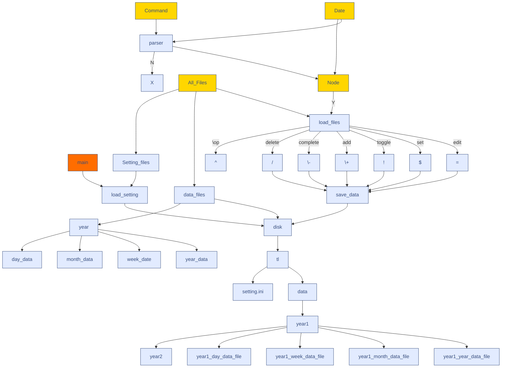

```mermaid
flowchart TB
    main["main"] --> load_setting["load_setting"]
    Command["Command"] --> parser["parser"]
    parser -- N --> X["X"]
    load_files["load_files"] -- \op --> show["^"]
    load_files -- delete --> delete["/"]
    delete --> save_data["save_data"]
    load_files -- complete --> complete["\-"]
    complete --> save_data
    load_files -- add --> add["\+"]
    add --> save_data
    load_files -- toggle --> toggle["!"]
    toggle --> save_data
    load_files -- set --> set["$"]
    set --> save_data
    load_files -- edit --> edit["="]
    edit --> save_data
    save_data --> disk["disk"]
    All_Files["All_Files"] --> Setting_files["Setting_files"] & data_files["data_files"] & load_files
    data_files --> year["year"] & disk
    year --> day_data["day_data"] & month_data["month_data"] & week_date["week_date"] & year_data["year_data"]
    Setting_files --> load_setting
    Date["Date"] --> Node
    Date["Date"] -->parser
    disk --> tl["tl"]
    tl --> setting.ini["setting.ini"] & data["data"]
    data --> year1["year1"]
    year1 --> year2["year2"] & year1_day_data_file["year1_day_data_file"] & year1_week_data_file["year1_week_data_file"] & year1_month_data_file["year1_month_data_file"] & year1_year_data_file["year1_year_data_file"]
    load_setting --> disk
    parser --> Node["Node"]
    Node -- Y --> load_files

     main:::Sky
     load_setting:::Sky
     Command:::Sky
     parser:::Sky
     X:::Sky
     load_files:::Sky
     show:::Sky
     delete:::Sky
     save_data:::Sky
     complete:::Sky
     add:::Sky
     toggle:::Sky
     set:::Sky
     edit:::Sky
     disk:::Sky
     All_Files:::Sky
     Setting_files:::Sky
     data_files:::Sky
     year:::Sky
     day_data:::Sky
     month_data:::Sky
     week_date:::Sky
     year_data:::Sky
     Date:::Sky
     tl:::Sky
     setting.ini:::Sky
     data:::Sky
     year1:::Sky
     year2:::Sky
     year1_day_data_file:::Sky
     year1_week_data_file:::Sky
     year1_month_data_file:::Sky
     year1_year_data_file:::Sky
     Node:::Sky
    classDef Sky stroke-width:1px, stroke-dasharray:none, stroke:#374D7C, fill:#E2EBFF, color:#374D7C
    style main fill:#FF6D00
    style Command fill:#FFD600
    style All_Files fill:#FFD600
    style Date fill:#FFD600
    style Node fill:#FFD600


```