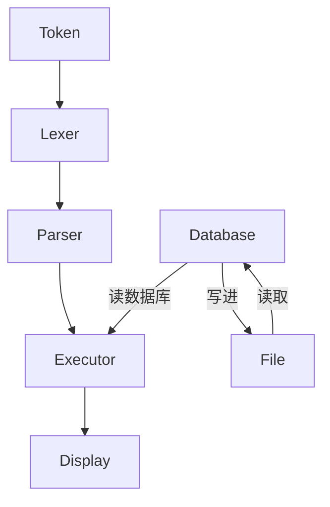

# 总架构图


## 数据结构
按照每一天来组织，每一天有多个任务，每个任务有多个步骤。

按照这种，可能使用数组会更好。
每天默认的任务有10个，超过就在加realloc即可。
将每天的任务存放在一个数组中，这就是当天的数组任务。
将每月的任务存放在一个数组中，这就是当月的数组任务。
将每年的任务存放在一个数组中，这就是当年的数组任务。

+ 1.读一小时书
+ 2.写代码
+ 3.跑步
- 4.看电影
- 5.电路知识

//因为要指示完成状态，所以需要使用标志位表示，所以需要使用结构体！
### 单个任务结构体
```c
typedef struct Task{
    char* task;
    int is_done;
}Task;
```

### 当天的任务
```c
char** task_day=(char**)malloc(sizeof(char*)*10);//首先有10个任务，多了在加
for(int i=0;i<10;i++){
    task_day[i]=(char*)malloc(sizeof(char)*100);//每个任务最多200个字符,多了在加
}
task_day[0]="1.读一小时书";
task_day[1]="2.写代码";
task_day[2]="3.跑步";
```

```c
// 任务编号就是数组的下标，从0开始
Task* task_day=(Task*)malloc(sizeof(Task)*10);//首先有10个任务，多了在加
for(int i=0;i<10;i++){//给单个任务分配空间
    task_day[i].task=(char*)malloc(sizeof(char)*100);//每个任务最多200个字符,多了在加
    task_day[i].is_done=0;//未完成
}

task_day[0]="1.读一小时书";
task_day[1]="2.写代码";
task_day[2]="3.跑步";
```

### 当年的任务
初始化总任务！
```c
//给当年分配空间
Task*** task_year=(Task***)malloc(sizeof(Task**)*12);//首先有12个月，这是固定的
//给出每个月的天数固定数组
int month_days[12]={31,28,31,30,31,30,31,31,30,31,30,31};
if(is_leap_year(year)){
    month_days[1]=29;//如果是闰年，二月多一天
}
// 给每个月的任务分配空间
//判断闰年等，如果是闰年，二月多一天
task_year[0]=(Task**)malloc(sizeof(Task*)*month_days[0]);
task_year[1]=(Task**)malloc(sizeof(Task*)*month_days[1]);
task_year[2]=(Task**)malloc(sizeof(Task*)*month_days[2]);
task_year[3]=(Task**)malloc(sizeof(Task*)*month_days[3]);
task_year[4]=(Task**)malloc(sizeof(Task*)*month_days[4]);
task_year[5]=(Task**)malloc(sizeof(Task*)*month_days[5]);
task_year[6]=(Task**)malloc(sizeof(Task*)*month_days[6]);
task_year[7]=(Task**)malloc(sizeof(Task*)*month_days[7]);
task_year[8]=(Task**)malloc(sizeof(Task*)*month_days[8]);
task_year[9]=(Task**)malloc(sizeof(Task*)*month_days[9]);
task_year[10]=(Task**)malloc(sizeof(Task*)*month_days[10]);
task_year[11]=(Task**)malloc(sizeof(Task*)*month_days[11]);
//给每一天的任务分配空间
// 任务编号就是数组的下标，从0开始
Task* task_day=(Task*)malloc(sizeof(Task)*10);//每天默认有10个任务，多了在加
for(int i=0;i<10;i++){//给单个任务分配空间
    task_day[i].task=(char*)malloc(sizeof(char)*100);//每个任务最多200个字符,多了在加
    task_day[i].is_done=0;//未完成
}
task_day[0]="1.读一小时书";
task_day[1]="2.写代码";
task_day[2]="3.跑步";
```
## 总的数据结构架构
```c
// 将每一年的任务单独放在一个文件里面


```